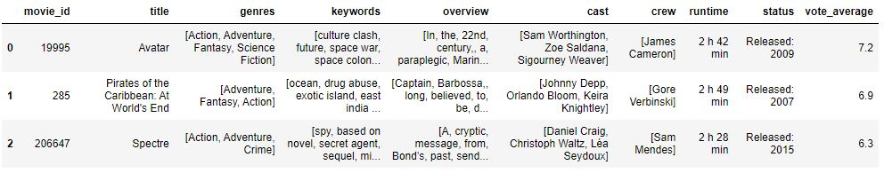
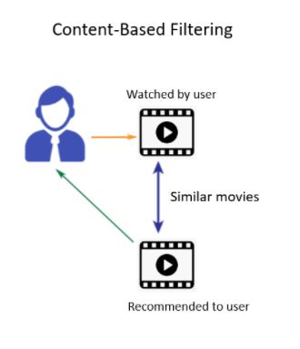
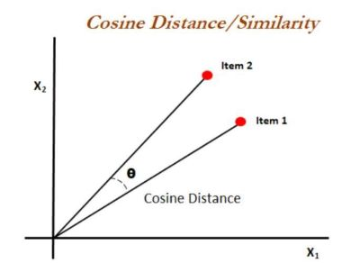

# Movie Recommendation System
This machine learning project implements a content-based movie recommendation system in Python that predicts or suggests movies based on user's movie interests. 

## Data

The dataset used can be downloaded from [Kaggle: TMDB 5000 Movie Dataset](https://www.kaggle.com/tmdb/tmdb-movie-metadata). It contains information of around 5000 movies. Out of all features present in this dataset, features which are used for this project are - movie_id, title,genres, keywords, overview, cast, crew, runtime, status, vote_average.

These data went through cleaning and preprocessing before applying machine learning algorithms.
The details of the movies(title, genre, runtime, rating, poster, etc) are fetched using an API by [TMDB](https://www.themoviedb.org/documentation/api) and using the TMDB id of the movie in the API.

### How to get the API key?

Create an account in https://www.themoviedb.org/, click on the `API` link from the left hand sidebar in your account settings and fill all the details to apply for API key. If you are asked for the website URL, just give "NA" if you don't have one. You will see the API key in your `API` sidebar once your request is approved.

## Approach

Content based algorithm attempts to figure out the user's favourite aspects of an item and then recommends similar items that includes those aspects. In this project, attributes such as genre, top 3 actors of the movie, overview/plot, director, and keywords representing the movie are used to make suggestions for the users. These features can provide a great insight on understanding users' preferences and help to produce better movie recommendations that are similar to their chosen movie. 

Those features will then be processed using TF-IDF Vectorizer, an algorithm that transforms text into meaningful representation of numbers which will be used to fit machine algorithm for prediction. Each term is assigned a dimension and associated vector that corresponds to the frequency of the term in the document, which allows for the Cosine Similarity measurement to distinguish and compare documents to each other based upon their similarities and overlap of subject matter. 

### Cosine similarity

Aforementioned, cosine similarity gives a useful measure of how similar two documents are likely to be in terms of their subject matter. It is a numerical value ranges between zero to one which helps to determine how much two items are similar to each other on a scale of zero to one. Mathematically, it measures the cosine of the angle between two vectors projected in a multi-dimensional space. The cosine similarity is advantageous because even if the two similar documents are far apart by the Euclidean distance (due to the size of the document), chances are they may still be oriented closer together. The smaller the angle, higher the cosine similarity.

Reference: [Understanding the Math behind Cosine Similarity](https://www.machinelearningplus.com/nlp/cosine-similarity/)

## 3 Deploy
streamlit
